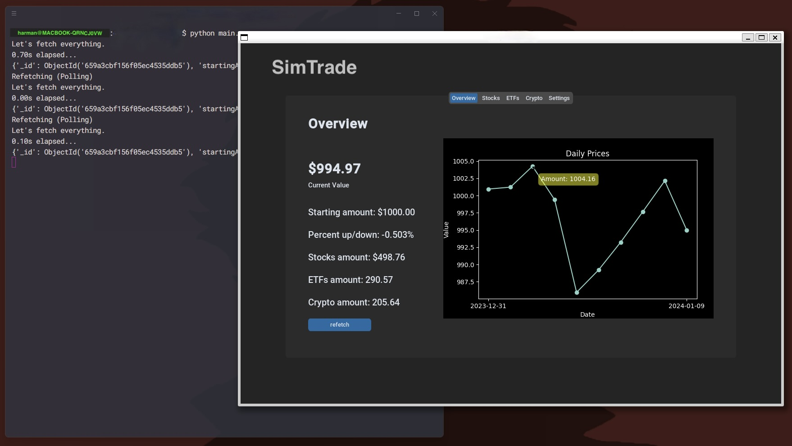
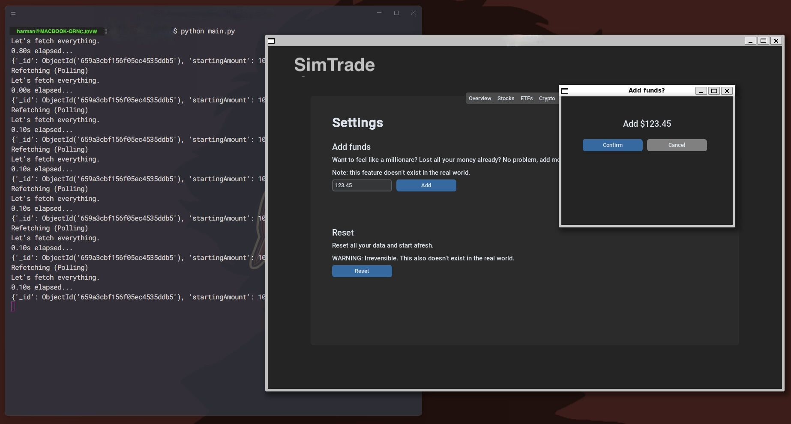

# SimTrade
SimTrade is a trading app (fake money) that uses the Mboum API for market information (real data).


# Images




# Features
Data is persisted in a MongoDB cluster. The GUI is made with CustomTKinter. Multithreading was used to have extra information logged to the terminal while fetching data (great for debugging), and to ensure long calls don't block the GUI.

# Usage
First, install some dependencies:
```
pip install customtkinter # The GUI
pip install dotenv # Environment Vars
pip install pymongo # MongoDB API for python
pip install requests # HTTP requests library
pip install mplcursors # To hover over the graph
```

Then create a `.env` file at the root. Set `MONGO_CONNECTION_STRING` to a connection string of a blank MongoDB cluster, and `MBOUM_API_KEY` to a MBOUM API key.

Finally, run `python main.py` in a terminal.


